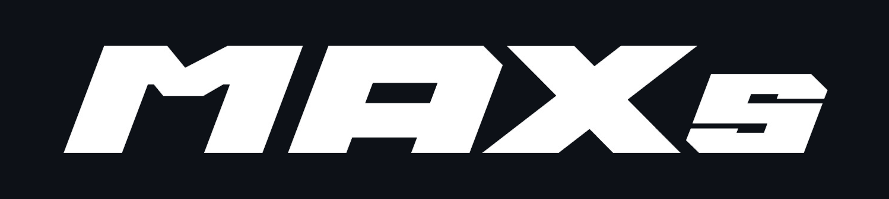

<p align="center"></p>

<p align="center"><b>AI 技术美术3D场景全流程 Claude 技能集 · 从一张概念图到 3D 资产 / 场景</b><br>
Full-pipeline Claude skills for AI technical art — concept art to 3D assets & scenes</p>

<p align="center">
  <a href="https://github.com/ziwuxin1/MAXs-Claude-Plugins/stargazers"></a>
  
  
  
  <br>
  
  
</p>

# MAXs Claude Plugins

MAXs Education 麦壳思游戏CG教育 官方 Claude 技能市场(marketplace)。

十个 skill 覆盖 AI 技术美术「从一张概念图到 3D 资产/场景」的全链路:提示词工程与资产拆解 → 图反推与二创 → 物体多视图 → 室内多机位 → 室外多机位 → 无缝 PBR 贴图，并提供 GPT 生图高亮噪点清理、AI 细节重建 4K 高清化、已有雕刻贴图转写实 Albedo，以及 GPT 从文字或参考直接生成 Albedo。技能结合麦壳思真实项目与课程经验；已实测案例与待实测工作模板分别标注。

## 安装

**Claude Code:**

```
/plugin marketplace add ziwuxin1/MAXs-Claude-Plugins
/plugin install maxs-skills@maxs
```

**Claude 桌面端(Cowork):** 设置 → 功能 → 添加技能市场,粘贴本仓库链接,Sync 后安装 **maxs-skills** 插件。

**更新:** `/plugin marketplace update maxs` 后更新 maxs-skills,即可拉到最新版全部 skill。

## 十件套速查

| Skill / 调用 ID | 菜单显示名 | 一句话定位 | 什么时候用 | 产出 |
|-------|-----------|-----------|-----------|------|
| `maxs-asset-breakdown` | MAXs · 资产拆解 \| Asset Breakdown | 提示词工程总纲 + 资产拆解陈列 | 拿到概念图要拆出部件做白底陈列图/重建喂图,或任何提示词写不稳的时候 | 资产陈列图/白底图提示词 + 复用包 |
| `maxs-image-to-prompt` | MAXs · 图转提示词 \| Image to Prompt | 图转提示词 v2:题材迁移 + 起点反推 | 把好构图搬到新题材(语境锁死),或借网图反推自己的起点;同场景变体请走多机位三件套 | 骨架卡 + 挂图迁移定稿模板 / 带【变量】起点模板 |
| `maxs-multiview-reference` | MAXs · 物体多视图 \| Object Multiview | 单物体多视图 | 一件资产要出前后左右俯视(建模施工图 / Hyper3D 喂图) | 保持句 + 八视角指令组 + Hyper3D 槽位对照 |
| `maxs-interior-multiangle` | MAXs · 室内多机位 \| Interior Views | 室内场景多机位 | 一张内景概念图要出反打/仰拍/俯瞰等整组机位(UE5 搭场景) | 空间身份句 + 十机位指令组 |
| `maxs-exterior-multiangle` | MAXs · 室外多机位 \| Exterior Views | 室外场景多机位 | 一张外景概念图要出俯瞰/远景/穿行等整组机位(UE5 室外关卡) | 场地身份句 + 九机位指令组 |
| `maxs-seamless-texture` | MAXs · MJ 无缝贴图 \| MJ Seamless Texture | Midjourney 无缝 PBR 贴图 | 要一张能平铺、进 Substance Sampler 做 PBR、贴进 UE5 的写实材质(地形/建筑/织物/科幻做旧) | 四品类 `--tile` 提示词 + Substance→UE5 完整 SOP |
| `maxs-gpt-highlight-cleanup` | MAXs · GPT 高亮清理 \| GPT Highlight Cleanup | MAXs 一键去除GPT生图高亮噪点 | 图片白点、闪点或粉笔状斑驳过密，希望保留结构并降低噪声 | 哑光清理图 + 可回退版本；无图像工具时提供提示词 |
| `maxs-gpt-detail-rebuild-4k` | MAXs · GPT 细节重建 4K \| GPT Detail Rebuild 4K | GPT AI 细节重建4K高清化 | 图片要真正高清化、补材质细节，不能只是像素放大 | AI 原始增强图 + 核验尺寸的 4K 导出图 + 处理记录 |
| `maxs-SD-to-Albedo` | MAXs · SD 转 Albedo \| SD to Albedo | 雕刻贴图转写实 Albedo | 已有 SD / ZBrush Height、Normal、AO，要保留布局并按参考生成基色 | Albedo + 按需 Roughness + 实测尺寸与验证记录 |
| `maxs-GPT-to-Albedo` | MAXs · GPT 生成 Albedo \| GPT to Albedo | GPT 直接生成 Albedo | 从文字或外观参考直接出颜色贴图，无需结构贴图 | Albedo 图片 + 实测尺寸 + 细节与平铺检查记录 |

菜单显示名统一使用 **MAXs · 中文名称 | English Name**，简短说明同样提供中英文，GPT、SD、MJ 等缩写保持大写；调用 ID 和目录保持兼容，已有 `$skill-name` 用法不变。插件名称 `maxs-skills` 是安装标识，不重复放进显示名。

若菜单同时出现 `Anthropic Skills: Maxs …`，这是另一插件中的副本，不是本插件重复注册。本插件提供 10 个技能；更新本插件不会删除其它插件的副本。整理重复项时先核对来源及其独有技能，避免为去重卸载仍在使用的其它功能。

## 各 Skill 详解

### 1. maxs-asset-breakdown · 提示词工程 SOP(总纲)

系列的地基。内核:可复用的提示词是经过「踩坑 → 过度纠正 → 简化收敛」三步迭代后留下的最简骨架。

- **五变量黄金模板**:把概念图中的结构部件拆成大中小排布的资产陈列图,五个可替换变量(场景类型/数量/光照/材质细节/目标风格)+ 三个不能动的骨架句("白背景。无阴影"必须放最后)
- **三步迭代法**:试水(短)→ 纠错(加)→ 简化(砍回最短)——终版比中间版短
- **已知 bug 模式表**:幽灵半成品、物件染色、白底变灰、比例错乱、风格漂移、抠图粘连,逐个给应对
- **S/A/B/C 分级 + 最小复用包**:对外/教学素材必须 A 级以上
- references:`prompt-templates`(模板库) / `iteration-cases`(迭代案例) / `output-quality-checklist`(学生自查清单) / `reuse-package-template`(复用包模板)

### 2. maxs-image-to-prompt · 题材迁移与起点反推 SOP (v2)

v2 重定位。铁律分流:目标图存在参考图就走图生图多机位三件套;本 skill 只管"目标图不存在"的两件事。

- **模式 A·挂图题材迁移**:原图当参考图上传,骨架由图保证,文字只换皮肉+锁语境。**语境锁死**:古代进古代出,跨语境迁移仅当用户显式点名
- **模式 B·起点反推**:把网图翻成带【可改变量】标记的提示词模板,填完变量就是你自己的第一版
- **骨架卡**两层(骨架层:布局/视线引导/冷暖对冲;题材层:含时代语境字段)
- **抽卡纪律**(多轮实测沉淀):单点失败先同提示词重抽 2-3 次再改词;补丁一次只加一个;终版比中间版短——堆约束的"修正版"实测全面劣于原版
- 精修阶段用**最小变更链**:满意图定为新基准,"只做一件事"式指令逐维微调
- references:`skeleton-card`(模板+同语境/跨语境双案例)

### 3. maxs-multiview-reference · 图生图多视图参考 SOP

一件资产 → 前后左右俯视一组。内核:多视图不是重新生成,是「同一个东西换镜头拍」。

- **黄金公式**:上传基准图 + [保持不变:风格/配色/结构] + [视角指令 ← 唯一变量] + [拍平无近大远小]
- **八视角指令库** + **Hyper3D(Rodin) 方向槽位对照表**(Front Left/Back/UP…,标错方向比不标更伤)
- **实测沉淀**:方位词模型犯懒 → 改说"地标在画面哪边";地标位置几何不可行时模型会**镜像冒充转角**(喂重建必废)→ 横长物体用"近/远"描述 + 并排比对自查
- **工具事实**:香蕉系无 seed、无负面提示参数;一致性靠参考图+同一对话;香蕉2 跑量、Pro 精修
- references:`view-prompt-library`

### 4. maxs-interior-multiangle · 室内场景多机位 SOP

一张内景概念图 → 整组机位。内核:派一个摄影师走进这个空间——空间身份锁死,镜头在里面走位。

- **机位前置黄金公式**(顺序是生死线,实测保持句在前会导致整组复刻):机位句前置 → 构图差异声明 → 逐机位光源推演 → 空间身份保持句殿后 → "不要复刻参考图的构图"收尾
- **十机位指令库**:定场/反打/左右侧打/仰拍/回廊俯瞰/轴线推近/特写/正仰视天花板/正俯视地板(后两个配合空间六面 3D 重建喂图)
- **逐机位光源推演**是室内命门:反打=逆光剪影、仰拍=天光入镜,光不是复制的,是按物理重新描述的
- **交付硬规范**:每条提示词完整自含,禁止"同样的要求"省略式交付
- references:`interior-shot-library`(含佛殿完整实测案例)

### 5. maxs-exterior-multiangle · 室外场景多机位 SOP

一张外景概念图 → 整组机位。内核:同一片场地、同一个太阳——每张图的影子方向都要能用"太阳在那边"解释通。

- **太阳/影子锚点**:从基准图影子反推太阳方位,每个机位按同一个太阳重推影子落向(反打=影子朝镜头拉长)
- **开放边界锁定**:拉远/反打时显式锁"地平线上没有城市和山脉",防模型脑补天际线
- **九机位指令库**:含无人机高角度、远景大全景、穿行 POV、黄昏氛围变体(唯一允许改太阳的机位)
- **实测沉淀**:开阔场景复制偏置强,侧打用"近/远法"点名谁在前景;涂鸦只写"痕迹"不写文字
- references:`exterior-shot-library`(含废料场完整实测案例)

### 6. maxs-seamless-texture · Midjourney 无缝 PBR 贴图 SOP

系列里走 **Midjourney** 的贴图 skill。内核:贴图不是"好看的图",是"能平铺、无光影、进得了 Substance 的平整材质"——把 MJ 从艺术家按回材质扫描仪。

- **四件套约束**(缺一出废图):正交满幅 / 平光无影 / 去风格化(`--style raw` + 低 `--s`)/ 可平铺(`--tile --ar 1:1`)
- **全流程**:MJ `--tile` 出无缝图 → Seamless Pattern Checker 验接缝(**别 upscale**)→ Substance Sampler(Image-to-Material + delight 去残留光影 + auto-tiling 兜底)→ 导出 UE5(**DirectX 法线** / ORM 打包)→ 引擎里平铺验证
- **四品类卡**:地形自然 / 建筑硬表面 / 织物皮革有机 / 科幻做旧,每类给能直接发的提示词 + 正反例;共坑一句话:母题别太大、别有独大特征(否则平铺复读)
- **写法与其它 skill 相反**:MJ 是 tag+参数模型,英文 tag、逗号堆叠、`--参数` 尾巴照写(香蕉那套"中文整句、无参数"在这里不适用)
- references:`texture-prompt-cards`(四品类模板+案例) / `substance-sampler-sop`(Sampler→UE5 完整 SOP)

### 7. maxs-gpt-highlight-cleanup · MAXs 一键去除GPT生图高亮噪点

对已经认可的图片做定向编辑：减少密集白色碎斑与闪点，保留主体结构、自然材质和体积感。

- 默认保留构图、几何、主要裂口和配件，只压低抢眼亮点，不整体压黑或模糊图片。
- 去噪后默认停止，不自动锐化或加回细节；另存版本，支持回到用户认可的结果。
- 附真实风化石阶案例与有效提示词：用户试过补细节版后，最终选回更干净的哑光版。
- 需要客户端提供图像编辑工具才能直接修图；安装技能不会额外赋予模型生图能力。当前案例使用内置 image_gen，未验证所有模型的效果。
- [技能入口](skills/maxs-gpt-highlight-cleanup/SKILL.md) · [实际案例](skills/maxs-gpt-highlight-cleanup/references/stone-stairs-case.md)

### 8. maxs-gpt-detail-rebuild-4k · GPT AI 细节重建4K高清化

先用图生图重建可信的材质与边缘细节，再读取实际分辨率并导出目标尺寸。区分普通插值放大、AI 重建和增强后的 4K 导出，不把“写了 4K 提示词”当作原生 4K 输出的证据。

- 保留已认可的造型、镜头、主要破损和配件分布，针对瓦片、木纹、苔藓与落叶等实际材质增强。
- 附屋顶三视图真实案例：用户拒绝纯放大，认可 AI 细节重建后导出 4K 的结果；局部重绘与多视图一致性仍需检查。
- 原图、AI 原始增强图和最终导出分别保存；附 PNG 尺寸导出脚本，保留比例与透明度并记录实测尺寸。脚本本身不做 AI 增强。
- 需要当前客户端提供图像编辑能力；无工具时说明限制，不擅自切到付费 API。
- [技能入口](skills/maxs-gpt-detail-rebuild-4k/SKILL.md) · [实际案例](skills/maxs-gpt-detail-rebuild-4k/references/roof-case.md)

### 9. maxs-SD-to-Albedo · 雕刻贴图转写实 Albedo

从已有 SD / ZBrush 结构贴图生成基色：源图决定布局，作品参考提供材质方向。附用户认可的中性旧砖原生生成图与实际提示词。

- 保留砌块位置、轮廓、主要破口和砂浆边界；不把参考里的规则砖排套到不规则源图上。
- 中性色差、可信陶土颗粒和局部旧化，避免艳橙、泛白、焦黑积垢及虫纹状假细节之间来回过度纠正。
- Roughness 按需推断，按材料而非基色亮度赋值；检查实际范围并按线性数据读取。
- 区分用户视觉认可、目视对应、像素配准、无缝平铺和引擎验收；原生尺寸与放大导出分别记录。
- 增加用户认可的无缝修复 v2：程序化边缘校色 + 四角局部修正，附脚本、测试、偏移与平铺验收；边缘像素相等不代表视觉无缝。
- 需要当前客户端图像编辑能力；无需切到 Midjourney 或覆盖原 Normal / AO。
- [技能入口](skills/maxs-SD-to-Albedo/SKILL.md) · [用户认可案例](skills/maxs-SD-to-Albedo/references/neutral-brick-case.md) · [无缝修复 v2](skills/maxs-SD-to-Albedo/references/seam-repair.md)

### 10. maxs-GPT-to-Albedo · GPT 直接生成 Albedo

从文字或材质参考直接生成平面基色图，沿用 `maxs-SD-to-Albedo` 的材质、颜色、细节和无缝验收要求。无需先提供 Height / Normal / AO。

- 用 GPT 实际出图，外观参考提供材料与旧化方向，不复制材质球、场景灯光或背景。
- 保持克制色彩、真实细节层次和无烘焙光影，避免泛白、艳色、焦黑与虫纹状假细节。
- 需要平铺时检查两轴、四角与原尺寸局部；可复用 SD 版校色流程，但不套用其旧图遮罩。
- 已有结构通道且要求对应时转 SD 版；新增 GPT 从零生成模板尚未作为独立实测成功案例。
- [技能入口](skills/maxs-GPT-to-Albedo/SKILL.md) · [GPT 提示词模板](skills/maxs-GPT-to-Albedo/references/prompt-templates.md)

## 推荐组合工作流

**资产线(单件):**
概念图 → `maxs-asset-breakdown` 拆解出白底资产图 → `maxs-multiview-reference` 出转角组 → Hyper3D 重建 → 进引擎

**场景线(空间):**
场景概念图(自己生成或 `maxs-image-to-prompt` 反推改造)→ `maxs-interior-multiangle` / `maxs-exterior-multiangle` 出机位组 → PureRef 参考板 → UE5 搭建

**贴图线(材质):**
材质需求 → `maxs-seamless-texture` 写 MJ `--tile` 提示词 → TAPNOW 出无缝图 → Substance Sampler 出 PBR → UE5

**已有雕刻贴图线：**
Height / Normal / AO + 材质参考 → `maxs-SD-to-Albedo` 生成基色 → 用户确认 → 按需 Roughness → 多通道对齐、平铺与引擎检查

**GPT 直接生成基色线：**
文字 / 外观参考 → `maxs-GPT-to-Albedo` 直接出图 → 色彩、细节与平铺检查 → 已认可 Albedo → 按需制作其它通道并另验对应关系

**高清交付线（按需）：**
已认可图片 / 单视图裁片 → `maxs-gpt-detail-rebuild-4k` 重建细节 → 检查造型与材质 → 核验尺寸 → 导出 4K 并说明是否包含放大步骤

## 通用工具事实(香蕉系,2026-06 核实)

- Nano Banana / Banana Pro / 香蕉2 均**不支持 seed**,也**没有负面提示参数**——一致性靠「参考图 + 同一对话」,排除项写成自然语言句子
- 对话式中文完整句子优于英文关键词堆叠;hex 色值有效但要绑着物件写
- 香蕉2 快 3-5 倍、约 95% 画质、中文理解更强:抽卡用香蕉2,精修用 Pro
- 每个角度/机位抽 2-4 张再判断;图上具体文字(招牌/涂鸦)不要试图保留
- ⚠️ **例外**:`maxs-seamless-texture` 走 **Midjourney**(非香蕉),用英文 tag + `--tile` / `--style raw` / `--s` / `--no` 等参数,写法与上面相反——贴图 PBR 链路专用,详见该 skill

高亮噪点清理、AI 细节重建和雕刻贴图转 Albedo 技能使用当前客户端的图像编辑工具；GPT 直接生成 Albedo 使用 GPT 生图能力。它们不沿用上述香蕉或 Midjourney 专用参数。去噪后不自动追加细节重建，按用户实际需求选择。

## 迭代

改 skill 内容后 `git push`,在 marketplace 里点 Sync/更新即可拉到最新版。每个 skill 的实测沉淀记录见各自的 `CHANGELOG.md`。

---

MAXs Education 麦壳思 · 游戏CG教育
