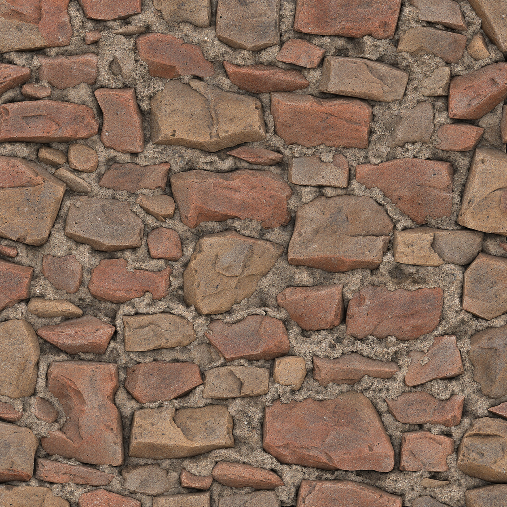

# 实际案例：ZBrush 砌块转中性旧砖

## 明确认可的结果（2026-10-05）

用户提供 `ZbrushStone_height.tga`、`ZbrushStone_normal.tga`、`ZbrushStone_AO.tga`，要求按旧墙砖参考生成 Albedo。源图均为 2048×2048；Height/AO 为 L，Normal 为 RGB。布局是大小不一、部分倾斜的砌块，不是参考图中的规则砖排。

多轮后用户强调“我要的是 Artstation AAA游戏”“颜色要中性的 不要走极端”。最终回到原始 AO，结合旧砖展示图及废弃墙体参考生成中性版。随后用户再次附上这张 Albedo，明确评价“这个生成的不错”，并要求做成技能。认可对象由附图确定，**不是仅凭上一条消息推断为 Roughness**。

上图只作为本案例的结果参考，不应自动作为其它任务的结构模板。未在仓库复制第三方作品参考图。输入角色与实际英文原文见 [approved-albedo-prompt.txt](approved-albedo-prompt.txt)。其中 image 1 是原始 AO；image 2 是旧红砖柱体展示；image 3 是废弃砖墙参考。

## 失败与纠正

| 反馈 | 发生的问题 | 应沉淀的决定 |
| --- | --- | --- |
| 颜色太艳 | 红橙色抢眼 | 收敛色度，保留温和材质色差，不改成全灰或泛白 |
| 不够旧、不够脏 | 仅改色，缺少真实风化层次 | 用薄积灰、局部水渍和接触处沉积；调整一种强度变量 |
| 每次都走极端 | 过度加入大片灰黑污斑，像烧焦 | 不把“更脏”解释为半面黑；保持砖材可读 |
| AI 感、细节丢失 | 连续重绘保留虫纹/刻纹，或去噪抹平 | 回原始结构参考，用陶土砂粒和自然夹杂重建；避免在失败图上累加 |
| 需要对应法线/AO | 外观重做可能漂移 | 保留结构优先；目视对应不等于像素精确 |

成功版本的方向：中等明度灰褐、少量褪色红和浅土褐；局部轻度积灰；细砂陶土颗粒；砂浆接触痕迹。提示词中的污渍覆盖 15–25% 仅是这次的视觉意图，未经分割测量，不是通用常数。

## 尺寸和验证边界

| 阶段 | 实际尺寸 / 状态 |
| --- | --- |
| 原始结构图 | 2048×2048 |
| 内置 image_gen 返回 Albedo | 1254×1254 |
| Albedo 导出 | Lanczos 放大至 2048×2048 |
| 布局 | 仅目视基本对应，未验证像素级配准 |
| 无缝及引擎效果 | 未验证；边缘仍有少量明暗 |
| 认可范围 | 用户认可本张 Albedo 的视觉结果，非 AAA 生产就绪认证 |

工具没有提供可复用 seed 或可确认的底层模型参数。不要把本次尺寸、一次成功或提示词要求当作工具保证。

## 后续 Roughness：仅记录尝试

另以中性 Albedo 生成灰度 Roughness，目标为砖面较粗、砂浆更粗、少量磨光处较低。生成后转 L 并导出 2048；原生同为 1254。没有独立的明确用户认可，也没有引擎反射验证。

该次 L 图实测范围 **51–255**、均值 **170.6/255**，没有严格符合提示词设定的范围，且局部残留形体明暗。因此仅附 [roughness-attempt-prompt.txt](roughness-attempt-prompt.txt) 供复现与排错，不把它视为已校准的 Roughness 标准。下次需要数值与区域检查，必要时调整后再验证；不复制一次未验收输出当作成功样例。
