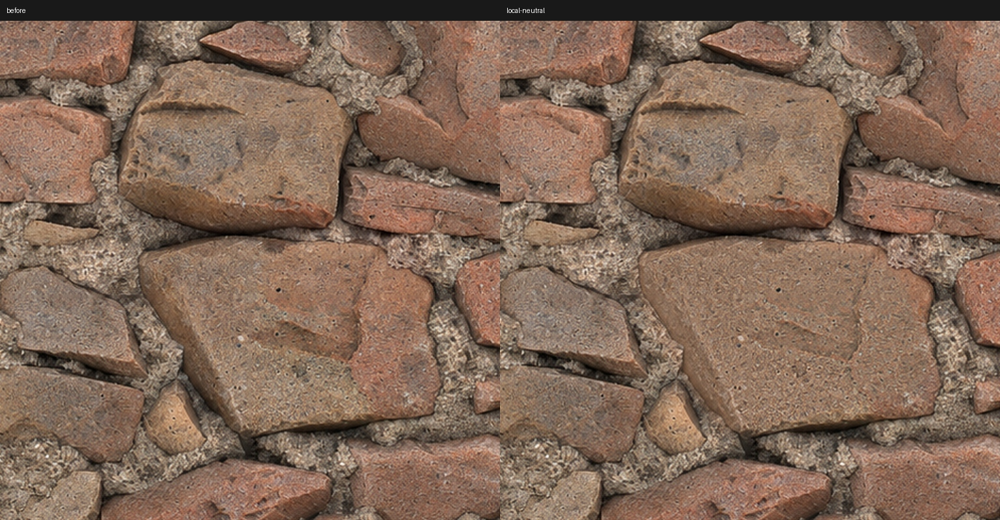

# 颜色接缝修复：边缘校色后还要检查四角

## 本次最终认可

最初中性 Albedo 获得外观认可，随后用户发现平铺时同一块砖被切成红/灰两种颜色。图生图“修无缝”仍残留色缝，并重绘了颗粒，未采用。

第一次程序化修正按多个尺度处理上下与左右色差。用户评价“比之前好多了”，但指出四角交汇的砖面仍有分区。第二次仅选中这一块跨边界的砖，在偏移视图中统一局部低频色调，再移回原 UV。用户随后明确评价：**“现在已经完美了”**，要求更新技能。



这次认可对应最终 v2，不对应原始生成图、图生图修补或第一次边缘校色。最终 v2 改动第一次修正图的 107773 个像素，占全图约 2.57%；选择区外像素完全一致。左右、上下边缘最大 RGB 差均为 0。检查了半幅偏移、局部原尺寸和 2×2 平铺；未补做整套通道或引擎认证。

## 决策流程

1. **先区分色差与几何错位。** 同一砖轮廓接得上、颜色情况不同，才是校色问题；轮廓/裂口不连续不能靠调色解决。用 AO/Normal 辅助确认，不将它们的阴影烘到 Albedo。
2. **使用最后认可的基准。** 接缝修复只处理颜色连续性，不借机重新生成整张。遵守当前客户端工具约束；用户已选择程序化校色后，无需每轮重复确认同一处理方式。
3. **半幅循环偏移用于检查。** 平移宽高各一半，把左右、上下与四角接缝移到图内。输出仍移回原坐标。非方图、奇数宽高也要使用同一组整数位移的逆变换，不能拉伸或留白拼贴。
4. **先处理明显跨边界色差。** 多尺度平滑的加性色偏场，大尺度处理色调，小尺度衔接边缘。修正范围限在边缘带；不整体模糊、不直接复制整条砖/砂浆边缘。这会调整近边缘颜色，可能不适合跨材质强边界，必须看实际图。
5. **再检查四角砖内部。** 边缘 RGB 差为零只说明边界样本一致，仍可能有十字过渡、斜率突变和砖内色块分区。若残留局限于一块砖，对偏移图画该砖的多边形选择区，排除砂浆和邻砖。
6. **局部 Lab 低频校色。** 用遮罩归一化的平滑提取色调，将低频色度向选区内部中值靠拢，按需减弱低频明度差；保留高频颗粒残差并羽化选区边缘。色度与明度强度分开控制，不把统一颜色变为抹平形体或全砖纯色。
7. **数值与视觉同时验收。** 检查边缘最大差、选区外像素是否一致；再看全图、2×2 平铺、无白缝的四角偏移图，以及原尺寸局部。数据不能代替视觉。若有连续的修补条带或失真，回退。

本次曾尝试对交汇处窄条做 inpaint，但产生可见的模糊十字条带，已丢弃。**最终认可版没有 inpaint，没有新增生成纹理，也没有改变几何坐标。** 不将这个失败尝试混入默认方案。

## 可复用脚本

[scripts/seam_color.py](../scripts/seam_color.py) 需要已有 Python、Pillow、NumPy 和 OpenCV。缺依赖时使用项目环境安装，不改系统环境。仅支持 RGB8 Albedo；拒绝 alpha、灰度/高位深数据图、覆盖源文件或已有输出。脚本不调用 AI，也不修复 Normal、AO、Height 或几何。

从技能目录执行：

```bash
python scripts/seam_color.py input.png edge-fixed.png --mode edges
python scripts/seam_color.py edge-fixed.png corner-fixed.png --mode region --region my-region.json
```

每步输出 PNG、`.png.json` 测量记录、`-offset.png` 偏移检查和 `-2x2.jpg` 平铺预览。JSON 记录仅证明校色操作和数值，不证明引擎表现或完美无缝。保持源分辨率，不自动做放大。

`edges` 的 2048 基准参数为 `(sigma, band width)`：`(24,260), (8,100), (2,24), (0,3)`；其它尺寸按短边比例调整。宽带只用于平滑色偏，源像素坐标不移动。图内远离边缘的区域保持原像素。

`region` 的 JSON 包含 `image_size: [width,height]` 和**半幅偏移视图**中的 `points: [[x,y],...]`。坐标尺寸必须匹配；不能把别的图片的选区直接套入。输入边缘应已匹配。脚本在恢复原 UV 后检查选区外像素不变，否则停止。

本案例配置 [neutral-brick-corner.json](neutral-brick-corner.json) 只适用于这张 2048 中性砖及其相同坐标布局，不是通用默认遮罩。参数为羽化 18px、平滑 sigma 6px、内部取样距离 28px、色度修正 1.0、明度修正 0.65。这些值用于复现，不强制其它材质同强度；从适当的小强度调整，保留材料的自然变化。

要复现实测结果：将本技能原有的 `neutral-brick-approved.png` 用 Pillow Lanczos 导出 2048，运行 `edges`，再用上述案例 JSON 运行 `region`。两步均在该 2048 导出上处理，属于颜色修复，不是原生 2K 生成或新细节恢复。
